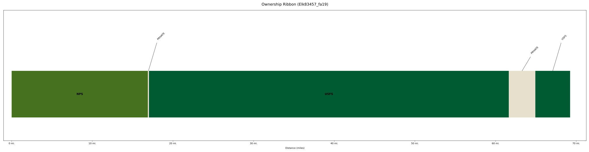
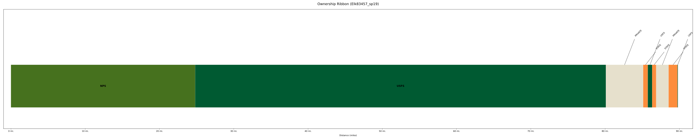
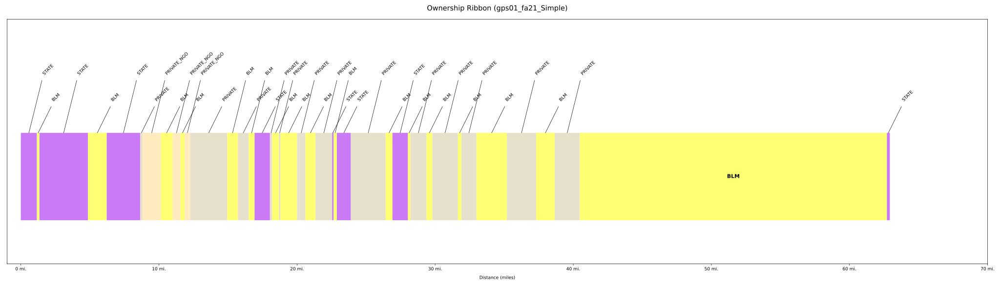
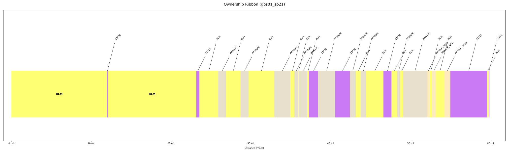
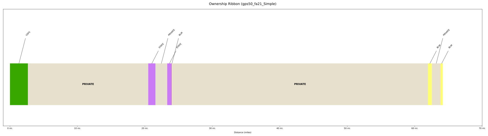
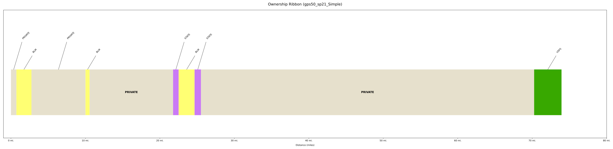

# Land Ownership Ribbons Automation 

This project automates the generation of **land ownership ribbon plots** from structured route data.  
It is designed for visualizing land ownership classifications, route indices, and ribbon plots along a given path.

## Features

- Parses land ownership classification data
- Extracts fields, lengths, and route indices
- Generates ribbon plots for visual comparison
- Designed for use in Jupyter Notebooks or as standalone Python scripts

---

## Setup (Requires ArcGIS Pro and ArcPy)

Install the required dependencies:

```bash
pip install matplotlib pandas numpy arcpy

```
## Example Plots: 











